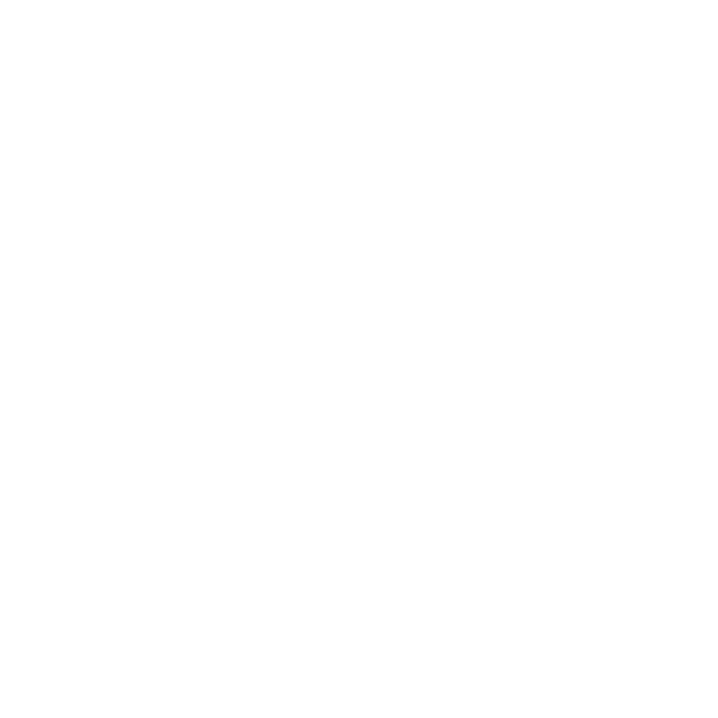

<p align="center">
  <picture>
  
</picture>
  <picture>
  <source media="(prefers-color-scheme: dark)" srcset="https://raw.githubusercontent.com/t3-oss/create-t3-app/99286f37324330ecdf75132fae1f246440a88035/www/public/images/t3-light.svg">
  
</picture>
</p>

<h1 align="center">
 Url Shortner Powered By the T3 Stack

</h1>

<p align="center">
  <a href="https://t3us.vercel.app/"
    >
    </a>
</p>

<p align="center" style="font-family: monospace">
  <a href="https://t3us.vercel.app/"
    >https://t3us.vercel.app/
    </a>
</p>

---

## 🧐 What's inside?

`url-shortener` is a free open source project built with the T3 Stack. It is a simple service allows you to shorten any URL and keep tracking of the number of clicks on your URL. It is built with the following technologies:

- 
- 
- 
- 
- 

Database Provider:

- 

Deployment:

- 

## 📸 Demo

## 🚀 Quick start

1.  **Clone the repo.**

    ```shell
    git clone https://github.com/t3-oss/create-t3-app.git
    ```

2.  **Install dependencies.**

    ```shell
    cd url-shortner
    npm install
    ```

3.  **Start developing.**

    ```shell
    npm run dev
    ```

    Your site is now running at `http://localhost:3000`!

4.  **Open the source code and start editing!**

## 📝 TBD

- [ ] Add Light/Dark Mode
- [ ] Add Authentication with Google, facebook and email-password authenticaion.
- [ ] Add User Dashboard
- [ ] Enable user to create custom short url
- [ ] Enable user to delete short url
- [ ] Enable user to revoke short url
- [ ] Add react table
- [ ] Infinite scroll instead of load more button
- [ ] Add comments to code
- [ ] Break the code into smaller components
